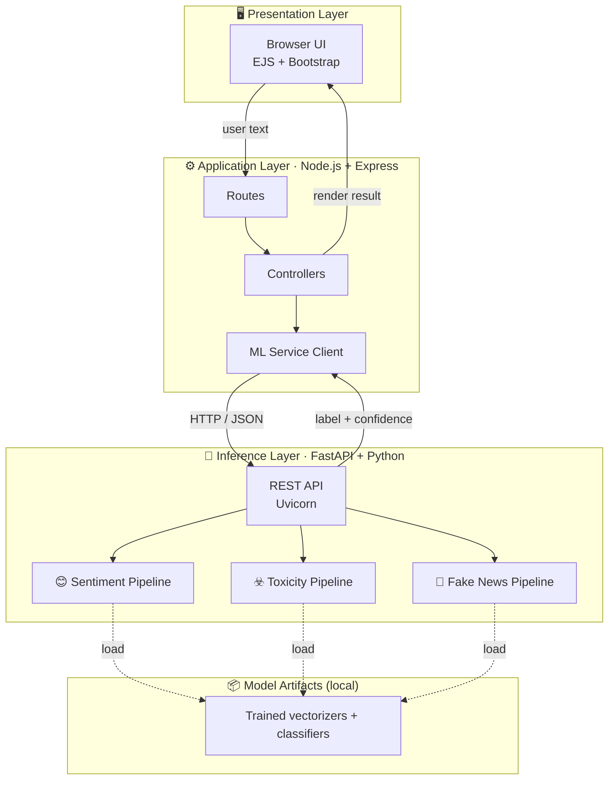
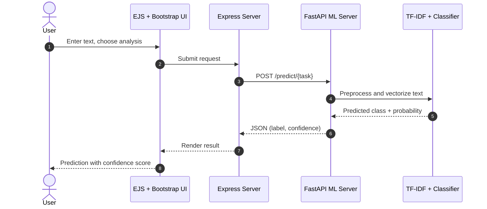
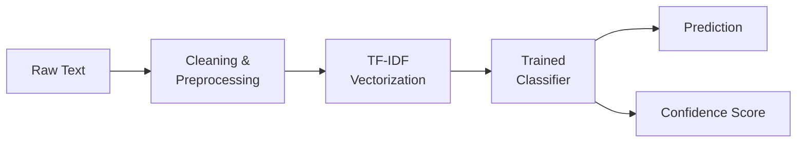

<div align="center">

# 🛡️ SENTINEL.AI

### A Full-Stack AI application for real-time content intelligence

**Sentiment Analysis · Toxicity Detection · Fake News Detection**
served through a decoupled **Node.js + FastAPI** architecture


| 🧠 AI Tasks | 🎯 Avg. Accuracy | 🧩 Services | 🔌 REST Endpoints |
|:---:|:---:|:---:|:---:|
| **3** | **88.89%** | **2** (Node.js + FastAPI) | **3** |

</div>

---

<a id="table-of-contents"></a>

## 📑 Table of Contents

**🔹 Part I: Understanding the System**

| No. | Section | What's Inside |
|:---:|:--------|:--------------|
| 01 | 🔭 [Overview](#overview) | The problem and what the application delivers |
| 02 | 🏗️ [System Architecture](#system-architecture) | Layered design across Node.js and FastAPI |
| 03 | 🔄 [Request Lifecycle](#request-lifecycle) | End-to-end flow of a single prediction |
| 04 | 🧬 [ML Pipeline](#ml-pipeline) | Preprocessing, TF-IDF, classifier, confidence score |

**🔹 Part II: Design and Implementation**

| No. | Section | What's Inside |
|:---:|:--------|:--------------|
| 05 | 🎯 [Supported Tasks](#supported-tasks) | Sentiment, toxicity and fake news detection |
| 06 | 🧠 [Engineering Decisions](#engineering-decisions) | Key trade-offs and the reasoning behind them |
| 07 | 🛠️ [Tech Stack](#tech-stack) | Languages, frameworks and libraries |
| 08 | 📂 [Project Structure](#project-structure) | Repository layout |

**🔹 Part III: Using the Project**

| No. | Section | What's Inside |
|:---:|:--------|:--------------|
| 09 | 📌 [API Reference](#api-reference) | Endpoints with sample request and response |
| 10 | ▶️ [Run Locally](#run-locally) | Setup and run instructions |
| 11 | 🗺️ [Roadmap](#roadmap) | Planned improvements |
| 12 | 👨‍💻 [About the Author](#about-the-author) | Who built this |

---

<a id="overview"></a>

## 🔭 Overview

Online text is noisy: reviews, comments, headlines and articles all need to be understood, moderated and verified at scale. **SENTINEL.AI** is a **Full-Stack AI** application that brings three AI capabilities together behind a single, consistent API:

1. **Sentiment Analysis**: what is the tone of the text?
2. **Toxicity Detection**: is the text abusive or harmful?
3. **Fake News Detection**: is the content likely to be misinformation?

Every prediction comes with a **confidence score**, so downstream users can decide how much to trust the result.

The project is built as **two independent services**: a Node.js web application for the user experience, and a Python FastAPI service dedicated to ML inference. This mirrors how real products separate application logic from model-serving.

[⬆ Back to top](#table-of-contents)

---

<a id="system-architecture"></a>

## 🏗️ System Architecture



**Design principles**

- **Separation of concerns:** UI, application logic and ML inference live in separate layers.
- **Independent services:** models can be retrained or replaced without touching the web app.
- **One consistent contract:** every task exposes the same request and response shape.

[⬆ Back to top](#table-of-contents)

---

<a id="request-lifecycle"></a>

## 🔄 Request Lifecycle



[⬆ Back to top](#table-of-contents)

---

<a id="ml-pipeline"></a>

## 🧬 ML Pipeline



Each task has its **own trained vectorizer and classifier**, so a model can be tuned for its specific domain: short emotional text for sentiment, abusive language for toxicity, long-form articles for fake news.

[⬆ Back to top](#table-of-contents)

---

<a id="supported-tasks"></a>

## 🎯 Supported Tasks

| # | Task | Endpoint | What it answers |
|:-:|------|----------|-----------------|
| 1 | 😊 **Sentiment Analysis** | `/predict/sentiment` | What is the emotional tone of this text? |
| 2 | ☣️ **Toxicity Detection** | `/predict/toxicity` | Does this text contain toxic or harmful language? |
| 3 | 📰 **Fake News Detection** | `/predict/fake-news` | Is this content likely real or fabricated? |

[⬆ Back to top](#table-of-contents)

---

<a id="engineering-decisions"></a>

## 🧠 Engineering Decisions

### Why TF-IDF over a transformer?
I benchmarked **DistilBERT** against a **TF-IDF + classical ML** pipeline, comparing the **latency vs. accuracy trade-off**. The TF-IDF models were deployed because for a real-time, multi-task API they deliver strong accuracy at a fraction of the inference cost, with no GPU required and far simpler operations and debugging.

> The best model on paper is not always the right model for the product.

### Why two services instead of one?
Node.js is well suited to serving the web layer, while the Python ecosystem is where the ML tooling lives. Splitting them lets each side use the best tools and scale independently.

### Why are datasets and trained models not committed?
Training data and serialized models are large and reproducible, so they are kept local to keep the repository lightweight. The pipeline is designed so models are trained locally and loaded by the inference server.

[⬆ Back to top](#table-of-contents)

---

<a id="tech-stack"></a>

## 🛠️ Tech Stack

| Layer | Technologies |
|-------|-------------|
| **Frontend** | EJS, Bootstrap |
| **Web Backend** | Node.js, Express.js |
| **ML Server** | FastAPI, Python, Uvicorn |
| **ML / NLP** | Scikit-learn, TF-IDF vectorization |
| **Architecture** | REST APIs, microservice-style separation |

[⬆ Back to top](#table-of-contents)

---

<a id="project-structure"></a>

## 📂 Project Structure

```
sentinel-ai/
├── ml-server/                 # FastAPI inference service
│   ├── app.py                 # API entry point and routing
│   ├── models/                # Model training / prediction code
│   ├── datasets/              # (local only)
│   ├── saved_models/          # (local only)
│   └── requirements.txt
│
└── node-server/               # Express web application
    ├── controllers/           # Request handling logic
    ├── routes/                # Route definitions
    ├── views/                 # EJS templates
    └── public/                # Static assets
```

[⬆ Back to top](#table-of-contents)

---

<a id="api-reference"></a>

## 📌 API Reference

| Method | Endpoint | Description |
|--------|----------|-------------|
| `POST` | `/predict/sentiment` | Sentiment analysis |
| `POST` | `/predict/toxicity` | Toxicity detection |
| `POST` | `/predict/fake-news` | Fake news detection |

**Example request**

```bash
curl -X POST http://127.0.0.1:8000/predict/sentiment \
  -H "Content-Type: application/json" \
  -d '{"text": "This product exceeded my expectations!"}'
```

**Example response**

```json
{
  "label": "positive",
  "confidence": 0.94
}
```

> The confidence score represents the model's prediction certainty.

[⬆ Back to top](#table-of-contents)

---

<a id="run-locally"></a>

## ▶️ Run Locally

**Prerequisites:** Python 3.9+, Node.js 18+

### 1️⃣ Clone the repository

```bash
git clone https://github.com/AdarshAgarwal2005/Sentinel-ai.git
cd Sentinel-ai
```

### 2️⃣ Start the ML server (Python)

```bash
cd ml-server
python -m venv venv

# Windows (PowerShell)
venv\Scripts\Activate.ps1
# macOS / Linux
source venv/bin/activate

pip install -r requirements.txt
uvicorn app:app --reload
```

ML server runs on 👉 `http://127.0.0.1:8000`

### 3️⃣ Start the web app (Node.js)

Open a new terminal:

```bash
cd node-server
npm install
npm start
```

Web app runs on 👉 `http://localhost:3000`

### ⚠️ Important notes

- `datasets/` and `saved_models/` are **not included** in the repository, so models must be trained locally before first use.
- Virtual environments are git-ignored.
- Both servers must be running for the web app to return predictions.

[⬆ Back to top](#table-of-contents)

---

<a id="roadmap"></a>

## 🗺️ Roadmap

- [ ] Containerize both services with Docker and `docker-compose`
- [ ] Optional DistilBERT inference mode (higher accuracy, higher latency)
- [ ] Batch prediction endpoint
- [ ] Per-task evaluation dashboard (precision, recall, F1)
- [ ] Cloud deployment with CI/CD

[⬆ Back to top](#table-of-contents)

---

<!--
## 📸 Screenshots
Add images to docs/screenshots/ and uncomment:


-->

<a id="about-the-author"></a>

## 👨‍💻 About the Author

<div align="center">

### **Adarsh Agarwal**
**AI/ML & Full-Stack Developer** · Final-year B.Tech CSE (AI & ML), Amity University Lucknow · Class of 2027

</div>

I build **backend systems and applied ML products**: secure REST APIs, payment flows, and deep learning models trained on large datasets.

- 🏢 Interned at **Tata Consultancy Services** (Product Developer) and **W3villa Technologies** (Software Developer)
- 🔐 Built **AccessHub**, an RBAC + JWT authentication system with 10+ REST endpoints
- 🧠 Built an **Alzheimer's stage detection CNN** with 95.53% accuracy on 25,000+ MRI scans
- 🧮 Solved **450+ DSA problems** on LeetCode (top 1.1%)
- 🎯 Looking for **full-time Software Engineer / AI-ML roles** (graduating April 2027)

<div align="center">

[](mailto:adarshagrawal2233@gmail.com)
[](https://github.com/AdarshAgarwal2005)
[](https://www.linkedin.com/in/YOUR-LINKEDIN-USERNAME)

⭐ If you found this project useful, consider giving it a star!

</div>
